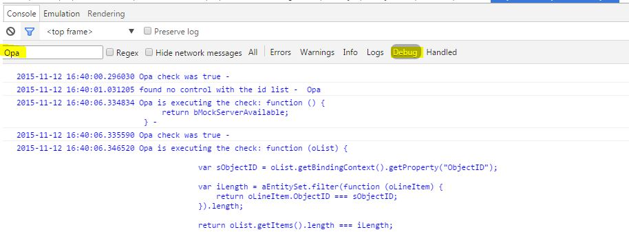

# Pitfalls and Troubleshooting

## Why does OPA not find the control I am looking for?

OPA checks a lot of conditions before it passes a control to your matchers/actions/sucess functions.
If your control does not match these conditions, you will never be able to set a breakpoint.
Therefore OPA logs a lot into the browsers console, if you turn on the debug mode of UI5.
You can either use the sap-ui-debug=true URL parameter or the [UI5 Diagnostics](https://openui5.hana.ondemand.com/#docs/guide/6ec18e80b0ce47f290bc2645b0cc86e6.html).
The Diagnostics may also be helpful to see the state of your UI.

After turning on the debug mode, you can have a look at the log and also filter it by looking for 'opa' or 'matchers'.



Frequent errors are typos in ViewName or control ids. These are easily discovered in the logs.

## My test is sometimes failing - sometimes it's not

### Is it the startup that fails?

Maybe the app is loading too slow for the OPA tests.
When having a local index file that does not contain the library dependencies your application needs,
the UI5 bootstrap is very slow. To fix this add the dependencies you need in your [Application Descriptor's sap.ui.dependencies namespace](https://openui5.hana.ondemand.com/docs/guide/be0cf40f61184b358b5faedaec98b2da.html).
if you do not have a descriptor use the [bootstrap option libs](https://openui5.hana.ondemand.com/docs/guide/91f2d03b6f4d1014b6dd926db0e91070.html)

### It fails in the middle of execution!

If this happens, your test is probably executing actions faster than it should. If you encounter a failure,
look at the current state of the UI - in almost all of the cases an action could not be triggered or a javascript error occurred.
The error should be in the console logs. If an action could not be executed please make sure you use the action parameter of
OPA5's waitFor function. When using the success function for triggering actions OPA5 does not check a lot of things.

Here are examples that occurred in applications:

An application was using the bindingContext of a control in a press handler. OPA5 was way faster than a human user, 
so the HTTP-Request that was sometimes finished by the time OPA5 was executing the check, sometimes it was still pending and there was an exception thrown.
The test failed because OPA was trying to reach a page that could not be shown because of the error.
This had to be fixed in the application coding.

When there was no action parameter available a ListItem got rerendered while a press action was executed on it.
Due to the rerendering the List was not able to perform the click and it was not executed and the test failed.
It only happened sometimes depending on the execution speed of the machine executing the test.
This now is detected automatically when using actions.


## OPA5 is failing on a specific browser what should i do?

### Am i comparing language dependent texts and the browser has a different language?
Check in the logs if your matcher fails because it is checking a text against a different language.
If you want to always execute your tests with the same language use the sap-ui-language=<myLanguage> url or bootstrap parameter.


### It is only the internet explorer
If you are using an IFrame to launch you application, internet explorer is more strict when it comes to objects from removed IFrames.
So if you are using the context of OPA to remember objects, then destroy your frame and then execute a function on the object, you will get a javascript exception.
How do you avoid it? Only remember values like strings or integers when destroying the frame, or use the component startup of OPA5.


## OPA is not even starting and there is no logging

If you require sinon-qunit.js, it overwrites the browser functions setTimeout and setInterval. OPA needs these functions and without them, the tests will not start. You can either set the fakeTimers to false in you test setup, or maybe you do not use sinon together with OPA.

```javascript
module("Opatests", {
    beforeEach : function () {
        sinon.config.useFakeTimers = false;
    },
    afterEach : function () {
        sinon.config.useFakeTimers = true;
    }
});
```